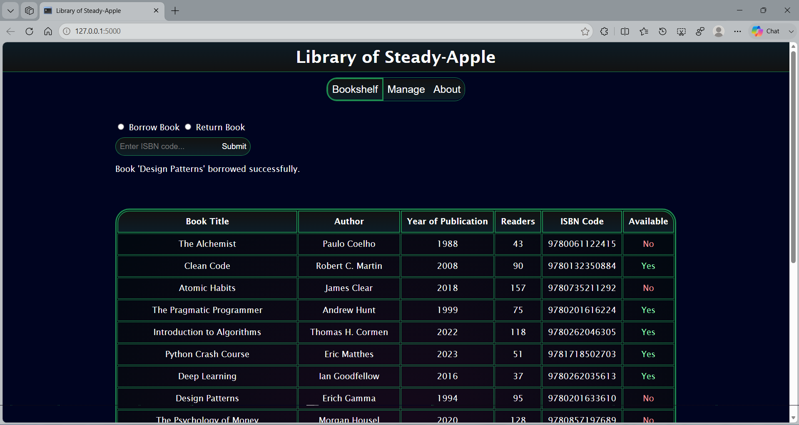

# Library Management System Web-App

This is my very first web-development project.

A library management system that lets you explore through the books, their popularity and other details. 

Each book has a unique identifier ISBN Code which lets you borrow or return a book.

I've tried to keep the UI minimal and modern.

## Implementations Ongoing

The app is currently unfinished, the finished version will have:

- A manage page for manager, allows to list/delist a book.

- Authorization page to keep log of users and managers.

- About page with a brief of the web-app.

## Tech-Stack

- Python

- Flask

- HTML

- CSS

## How to Run

### Requirements

- Python with Flask modules installed

- HTML5, CSS3 compatible browser

```bash
git clone https://github.com/MayankArambhi/Library-Management-System.git
cd Library-Management-System
python -m app.py
```
Open http://127.0.0.1:5000 in the browser.

## Screenshots
